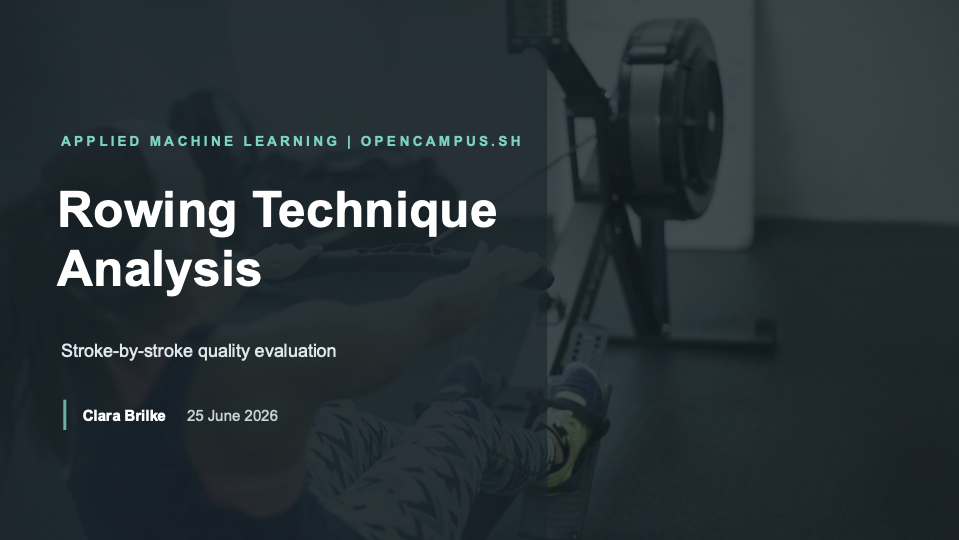

# Rowing Technique Analysis

## Repository Link

[https://github.com/clarabri/ML-project](https://github.com/clarabri/ML-project)

## Description

Rowing badly on an ergometer does more than waste effort — it is a common route to back and knee injuries. The people most exposed are the ones least likely to be corrected: beginners, and gym users who take the erg for cardio without ever being coached.

This project asks whether a **single video** is enough to tell them when a stroke is wrong. No on-body sensors, no instrumented handle, no hardware beyond a phone on the floor.

Side-view recordings are run through **MediaPipe Pose**, normalized to be body-relative, and segmented into individual strokes. Two models are then compared: a supervised Random Forest trained on good and faulty strokes, and an LSTM autoencoder trained on good strokes only, which flags anything it cannot reconstruct.

The headline finding is a negative one, and it is the substance of the project: **both models score highly on a conventional split and neither actually detects faulty technique.** They recognise *who* is rowing instead. Diagnosing that, and quantifying what the dataset would need to fix it, is the main contribution.

### Task Type

Binary classification (good vs. faulty technique) and one-class anomaly detection, on pose-landmark time series.

### Results Summary

#### Best Model Performance
- **Best Model:** LSTM Autoencoder (one-class, trained on good strokes only)
- **Evaluation Metric:** ROC-AUC, evaluated with a whole recording held out
- **Final Performance:** **mean ROC-AUC 0.620** across held-out recordings — above chance, but not usable. On the conventional random split the same model scores 0.987.

#### Model Comparison

| Model | Random / stroke split | Held-out recording |
|---|---|---|
| DummyClassifier (majority) | 0.836 accuracy | — |
| Random Forest (baseline) | 0.981 accuracy, 0.998 ROC-AUC | 5.4 % of bad frames detected |
| LSTM Autoencoder | 0.987 ROC-AUC | mean ROC-AUC 0.620 |

- **Baseline Performance:** Random Forest, 0.981 accuracy on a stroke-aware split — which collapses to 5.4 % recall once an entire recording is held out.
- **Improvement Over Baseline:** the autoencoder is the only model that stays above chance under recording-level validation. The improvement is structural rather than numerical: because it never sees a bad stroke, it cannot learn the shortcut the Random Forest learned.
- **Best Alternative Model:** Random Forest — higher headline numbers, no generalization to unseen rowers.

#### Key Insights

- **Most Important Features:** wrist-y carries the strongest phase signal (−0.40 correlation), followed by shoulder-y; left/right landmark pairs are ~0.91 correlated, so the effective dimensionality is far below 66. Absolute positions correlate only weakly with the labels — the information lies in the *direction* of movement, not in position.
- **Model Strengths:** stroke segmentation is reliable (657 of 668 detected peaks become complete strokes, the rest are structural), pose detection is complete, and the one-class framing removes the label shortcut the baseline fell for.
- **Model Limitations:** the decisive one — **the models identify the rower, not the technique.** The same landmark features predict which of four rowers is in frame with 99.6 % accuracy. Since all faulty strokes come from a single rower, "bad technique" and "this person" are not separable, and no architecture resolves that. A diversity sweep shows more *good* rowers do not help: the error on unseen good recordings and on bad strokes falls in lockstep.
- **Business Impact:** not deployable, and the failure mode is exactly the target group. A beginner or gym user is by definition a rower the model has never seen — and shown an unseen rower, the baseline labels ~5 % of faulty strokes as faulty while the autoencoder scores near chance. Warning someone about their back only helps if it works on the first session. The unlock is data, not modelling: faulty recordings from several rowers, all demonstrating the same fault catalogue — roughly 2 minutes of video per fault per rower.

## Documentation

| Step | Notebook | Write-up |
|---|---|---|
| 0 · Literature Review | — | [README](0_LiteratureReview/README.md) |
| 1 · Dataset Characteristics | [exploratory_data_analysis.ipynb](1_DatasetCharacteristics/exploratory_data_analysis.ipynb) | [README](1_DatasetCharacteristics/README.md) |
| 2 · Baseline Model | [baseline_model.ipynb](2_BaselineModel/baseline_model.ipynb) | [README](2_BaselineModel/README.md) |
| 3 · Model Definition and Evaluation | [model_definition_evaluation.ipynb](3_Model/model_definition_evaluation.ipynb) | [README](3_Model/README.md) |
| 4 · Presentation | — | [Slides (PDF)](4_Presentation/Presentation.pdf) · [PPTX](4_Presentation/Presentation.pptx) |

Preprocessing (pose extraction, normalization, stroke segmentation) lives in
[Data_Preparation/Mediapipe.ipynb](1_DatasetCharacteristics/Data_Preparation/Mediapipe.ipynb);
[SETUP.md](SETUP.md) covers the environment.

### Dataset at a Glance

Privately held — the videos were recorded on the condition that they would not be published.

| | |
|---|---|
| Recordings | 11 videos, 4 rowers, ~30 minutes |
| Frames | 18,139 at 10 fps (downsampled from 30 fps) |
| Strokes | 657 (578 good / 79 faulty), 18.4 – 26.0 spm |
| Features | 66 body-relative landmark coordinates (33 landmarks × x, y) |
| Labels | `phase` (recovery / drive) and `GOOD` / `BAD` |

## Cover Image

